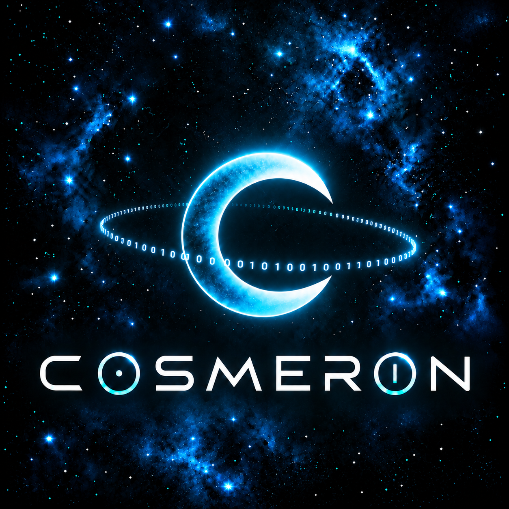

<p align="center">
  
</p>

# Cosmeron

**Cosmeron é uma biblioteca modular C11, orientada a headers, para programação de sistemas portátil, experimentação, educação e componentes reutilizáveis de baixo nível.**

Cosmeron dá continuidade ao projeto anteriormente desenvolvido como **Congro;Library**, preservando sua arquitetura e seus princípios em uma estrutura de repositório mais limpa e sob uma nova identidade pública.

[Documentação](../../README.md) · [Roadmap](../../Project/ROADMAP.md) · [Pattern](../../Reference/PATTERN.md) · [Entropia](../../Project/ENTROPY.md) · [Por que EUPL?](Governance/LICENSING.md) · [Código de Conduta](Governance/CODE_OF_CONDUCT.md) · [Créditos](Governance/AUTHORS.md) · [English](../../../README.md) · [Español (Latinoamérica)](../Espanol-LATAM/README.md)

## O que é Cosmeron?

Cosmeron é uma biblioteca de sistemas em C11 construída como um conjunto de componentes pequenos e compreensíveis, e não como uma caixa-preta. O código-fonte deve ser útil tanto **como biblioteca** quanto **como código que vale a pena estudar**.

Seus princípios centrais são:

- **Legibilidade** — abstrações devem tornar a intenção mais clara.
- **Modularidade** — componentes devem continuar úteis de forma independente.
- **Padronização** — nomes, erros, ownership e APIs geradas seguem regras comuns.
- **Portabilidade** — conceitos específicos de sistemas operacionais ficam fora da API pública sempre que possível.
- **Educação** — a implementação deve continuar compreensível o bastante para ensinar.

> **Uma lib para cientistas malucos:** explore sistemas de baixo nível sem transformar o código em um sítio arqueológico.

## Arquitetura

```text
Codespace/Cosmeron/
├── Core/
└── Modules/
```

A biblioteca segue uma arquitetura orientada a headers. Páginas de implementação como arquivos `.impl` são incluídas pelos headers e não exigem unidades de tradução separadas do usuário.

Quando viável, Cosmeron também segue uma filosofia **zero-link**, evitando flags obrigatórias como `-lm`, `-pthread` e `-lws2_32`.

## Estilo de API

As funções podem ser acessadas pela forma gerada por macro ou diretamente:

```c
BIT_FUNC(32, Popcount)(flags);
Bit_32_Popcount(flags);
```

Operações falíveis retornam `OPSTATUS`; resultados principais são produzidos por parâmetros de saída explícitos.

## Estado

**Experimental / em desenvolvimento ativo.** APIs e estrutura ainda podem mudar antes da primeira release canônica de Cosmeron.

## Licença

Cosmeron é licenciada sob a **Licença Pública da União Europeia 1.2 somente (EUPL-1.2)**.

---

> Continue curioso. Quebre coisas. Aprenda.
