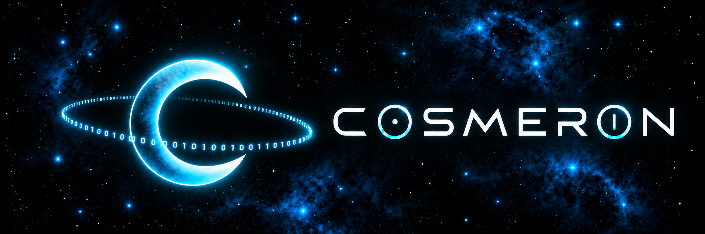

<p align="center">
  
</p>

# Cosmeron

**Cosmeron is a modular, header-oriented C11 library for portable systems programming, experimentation, education, and reusable low-level components.** It favors readable APIs, explicit ownership, consistent naming, composable modules, and portability without hiding how the machine works.

Cosmeron continues the project previously developed as **Congro;Library**, carrying its architecture and design principles into a cleaner repository and a new public identity.

**Keywords:** C11, C library, header-only C, single-header C, systems programming, portable C, data structures, containers, concurrency, coroutines, networking, sockets, Unicode, terminal UI, mathematics, memory management, metaprogramming, generic C.

[Documentation](Docs/README.md) · [Roadmap](Docs/Project/ROADMAP.md) · [Pattern](Docs/Reference/PATTERN.md) · [Entropy](Docs/Project/ENTROPY.md) · [Why EUPL?](Docs/Governance/LICENSING.md) · [Code of Conduct](Docs/Governance/CODE_OF_CONDUCT.md) · [Credits](Docs/Governance/AUTHORS.md) · [Português (Brasil)](Docs/Translations/Portugues-Brasil/README.md) · [Español (Latinoamérica)](Docs/Translations/Espanol-LATAM/README.md)

## What is Cosmeron?

Cosmeron is a C11 systems library built as a set of small, understandable components rather than a black box. Its source is intended to be useful both **as a library** and **as code worth reading**.

The project is designed around five ideas:

| Principle | Meaning |
| --- | --- |
| **Readable** | Abstractions should make intent clearer, not obscure it. |
| **Modular** | Components should remain independently useful and composable. |
| **Standardized** | Naming, errors, ownership, and generated APIs follow shared rules. |
| **Portable** | Public interfaces avoid leaking platform-specific vocabulary when practical. |
| **Educational** | The implementation should remain understandable enough to learn from. |

> **A lib for mad scientists:** explore low-level systems without turning the source into an archaeological site.

## Domains

The current architecture covers or is designed around:

- **Core:** algorithms, casting, errors, memory, namespaces, and preprocessing.
- **Bit:** bit manipulation and low-level integer utilities.
- **Chronometry:** calendars, clocks, dates, durations, timers, epochs, and time zones.
- **Concurrency:** atomics, threads, synchronization, coroutines, tasks/futures, and thread pools.
- **Container:** generic arrays, strings, vectors, queues, stacks, linked structures, trees, hashes, and graphs.
- **Math:** arithmetic, ranges, clamps, values, and equation helpers.
- **Network:** addresses, sockets, listeners, datagrams, polling, and name resolution.
- **Random:** entropy sources, deterministic engines, distributions, mixers, and shuffling.
- **Struct:** reusable typed pair/tuple-like structures.
- **Text:** UTF-8/UTF-16, Unicode, text grids, and terminal-oriented text structures.
- **Type:** fundamental typed operations and extended numeric/value types.

Planned domains such as Filesystem, Input, Terminal, TUI, Graphics, Parsing, Serialization, Event Loop, Audio, and more are tracked in the [roadmap](Docs/Project/ROADMAP.md).

## Architecture

The canonical source layout is organized around a small core and independent modules:

```text
Codespace/Cosmeron/
├── Core/
└── Modules/
```

Public headers expose the API. Implementation pages such as `.impl` files are included by headers rather than linked as separate user translation units.

Cosmeron follows a **zero-link philosophy where viable**: users should not need extra linker flags such as `-lm`, `-pthread`, or `-lws2_32` when the same behavior can be provided portably without them.

## API style

Cosmeron uses namespaced generated APIs while keeping direct C symbols available.

```c
BIT_FUNC(32, Popcount)(flags);
Bit_32_Popcount(flags);
```

Fallible operations return `OPSTATUS`; primary results are written through explicit output parameters. Predicates return `bool`. Ownership and native-platform boundaries are intended to remain visible rather than implicit.

The complete grammar is documented in [Cosmeron Pattern](Docs/Reference/PATTERN.md).

## Status

**Experimental / active development.** APIs and repository structure may still change before the first canonical Cosmeron release.

## Contributing

Experiments, fixes, tests, documentation, and constructive technical criticism are welcome. Participation is governed by the [Code of Conduct](Docs/Governance/CODE_OF_CONDUCT.md).

## License

Cosmeron is licensed under the **European Union Public Licence 1.2 only (EUPL-1.2)**.

See [Why EUPL 1.2?](Docs/Governance/LICENSING.md) for the project's licensing rationale.

---

> Stay curious. Break things. Learn.
